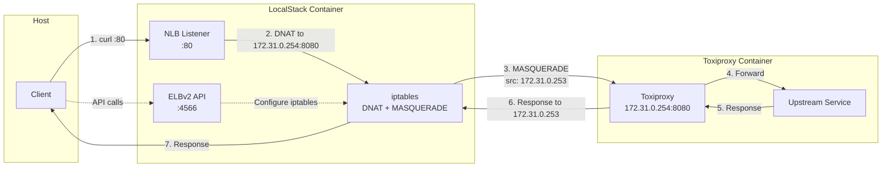

# Network Load Balancer (NLB) Implementation for LocalStack

This document describes the custom NLB implementation for LocalStack that uses iptables for actual traffic forwarding.

## Overview

This implementation provides a minimal but functional Network Load Balancer that:
- Accepts standard AWS ELBv2 API calls
- Creates real iptables rules to forward traffic
- Routes all traffic through a fixed target IP (toxiproxy)

## Architecture



## Network Topology

```mermaid
flowchart TB
    subgraph toxinetwork [toxinetwork - 172.31.0.0/16]
        LS[LocalStack<br/>172.31.0.253]
        TP[Toxiproxy<br/>172.31.0.254]
        GW[Gateway<br/>172.31.0.1]
    end

    subgraph default [default network]
        LS2[LocalStack]
        OTHER[Other Services]
    end

    LS --- LS2
    LS <-->|Traffic Flow| TP
```

## Components

### 1. ELBv2 API Interface

**File:** `localstack-core/localstack/aws/api/elbv2/__init__.py`

Defines the API interface matching AWS ELBv2 operations:
- `CreateLoadBalancer`
- `DeleteLoadBalancer`
- `DescribeLoadBalancers`
- `CreateTargetGroup`
- `DeleteTargetGroup`
- `DescribeTargetGroups`
- `RegisterTargets`
- `DeregisterTargets`
- `CreateListener`
- `DeleteListener`
- `DescribeListeners`

### 2. State Storage

**File:** `localstack-core/localstack/services/elbv2/models.py`

Stores NLB state in memory:
- `LoadBalancerState` - NLB configuration
- `TargetGroupState` - Target group with registered targets
- `ListenerState` - Listener configuration with port and actions
- `ELBv2Store` - Per-account/region state store

### 3. Provider Implementation

**File:** `localstack-core/localstack/services/elbv2/provider.py`

Implements the API and manages iptables rules:

```python
# Fixed target IP - all traffic forwards here
TARGET_IP = "172.31.0.254"
```

#### iptables Rules Created

When a listener is created with a target group:

```bash
# PREROUTING - for traffic coming into the container
iptables -t nat -A PREROUTING -p tcp --dport 80 -j DNAT --to-destination 172.31.0.254:8080

# OUTPUT - for traffic originating from within the container
iptables -t nat -A OUTPUT -p tcp --dport 80 -j DNAT --to-destination 172.31.0.254:8080

# POSTROUTING - MASQUERADE so return traffic comes back
iptables -t nat -A POSTROUTING -d 172.31.0.254 -j MASQUERADE
```

### 4. Provider Registration

**File:** `localstack-core/localstack/services/providers.py`

```python
@aws_provider(api="elbv2")
def elbv2():
    from localstack.services.elbv2.provider import ELBv2Provider
    provider = ELBv2Provider()
    return Service.for_provider(provider)
```

## Traffic Flow Explained

### Step-by-Step Flow

1. **Client Request**: Client sends request to LocalStack container on port 80
2. **PREROUTING DNAT**: iptables rewrites destination from `:80` to `172.31.0.254:8080`
3. **POSTROUTING MASQUERADE**: Source IP rewritten from original to `172.31.0.253` (LocalStack's IP on toxinetwork)
4. **Toxiproxy Receives**: Request arrives at toxiproxy from `172.31.0.253`
5. **Upstream Forward**: Toxiproxy forwards to configured upstream service
6. **Response Path**: Response travels back through the same path in reverse

### Why MASQUERADE is Required

Without MASQUERADE:
- Traffic arrives at toxiproxy with source IP `172.31.0.1` (gateway)
- Toxiproxy sends response to `172.31.0.1`
- Response never reaches the original client

With MASQUERADE:
- Traffic arrives at toxiproxy with source IP `172.31.0.253` (LocalStack)
- Toxiproxy sends response to `172.31.0.253`
- LocalStack receives response and forwards to original client

## Docker Compose Configuration

### LocalStack Service

```yaml
services:
  localstack:
    container_name: "localstack"
    image: localstack/localstack:latest
    ports:
      - "127.0.0.1:4566:4566"
    cap_add:
      - NET_ADMIN              # Required for iptables
    sysctls:
      - net.ipv4.ip_forward=1  # Required for forwarding
    networks:
      default:
      toxinetwork:
        ipv4_address: 172.31.0.253
```

### Network Definition

```yaml
networks:
  toxinetwork:
    driver: bridge
    ipam:
      config:
        - subnet: 172.31.0.0/16
          gateway: 172.31.0.1
```

## Usage

### Create NLB with One-Liner

```bash
EP=http://localhost:4566 && \
NLB_ARN=$(aws --endpoint-url=$EP elbv2 create-load-balancer --name my-nlb --type network --subnets subnet-123 --query 'LoadBalancers[0].LoadBalancerArn' --output text) && \
TG_ARN=$(aws --endpoint-url=$EP elbv2 create-target-group --name my-targets --protocol TCP --port 8080 --query 'TargetGroups[0].TargetGroupArn' --output text) && \
aws --endpoint-url=$EP elbv2 register-targets --target-group-arn $TG_ARN --targets Id=10.0.0.1,Port=8080 && \
aws --endpoint-url=$EP elbv2 create-listener --load-balancer-arn $NLB_ARN --protocol TCP --port 80 --default-actions Type=forward,TargetGroupArn=$TG_ARN
```

### Verify iptables Rules

```bash
docker exec -u root localstack iptables -t nat -S
```

Expected output:
```
-P PREROUTING ACCEPT
-P INPUT ACCEPT
-P OUTPUT ACCEPT
-P POSTROUTING ACCEPT
-A PREROUTING -p tcp -m tcp --dport 80 -j DNAT --to-destination 172.31.0.254:8080
-A OUTPUT -p tcp -m tcp --dport 80 -j DNAT --to-destination 172.31.0.254:8080
-A POSTROUTING -d 172.31.0.254/32 -j MASQUERADE
```

### Test Traffic Flow

```bash
# From host (if port 80 is exposed)
curl -v localhost:80

# From inside LocalStack container
docker exec -it localstack curl -v localhost:80
```

## Debugging

### Check iptables Rules
```bash
docker exec -u root localstack iptables -t nat -L -n -v
```

### Check Network Connectivity
```bash
# From LocalStack to Toxiproxy
docker exec -it localstack curl -v 172.31.0.254:8080

# Check LocalStack's IP on toxinetwork
docker exec -it localstack ip addr | grep 172.31
```

### Watch Traffic with tcpdump

On LocalStack:
```bash
docker exec -it localstack tcpdump -i any port 80 or port 8080 -n
```

On Toxiproxy:
```bash
docker exec -it toxiproxy tcpdump -i any port 8080 -n
```

## Limitations

1. **Single Target IP**: All traffic forwards to `172.31.0.254` regardless of registered target IPs
2. **TCP Only**: Currently only supports TCP protocol
3. **No Health Checks**: Target health checks are not implemented
4. **No Persistence**: iptables rules are lost on container restart
5. **No UDP Support**: Only TCP traffic is forwarded

## Files Changed

| File | Description |
|------|-------------|
| `localstack-core/localstack/aws/api/elbv2/__init__.py` | API interface and exceptions |
| `localstack-core/localstack/services/elbv2/__init__.py` | Package init |
| `localstack-core/localstack/services/elbv2/models.py` | State storage classes |
| `localstack-core/localstack/services/elbv2/provider.py` | Provider with iptables logic |
| `localstack-core/localstack/services/providers.py` | Provider registration |
